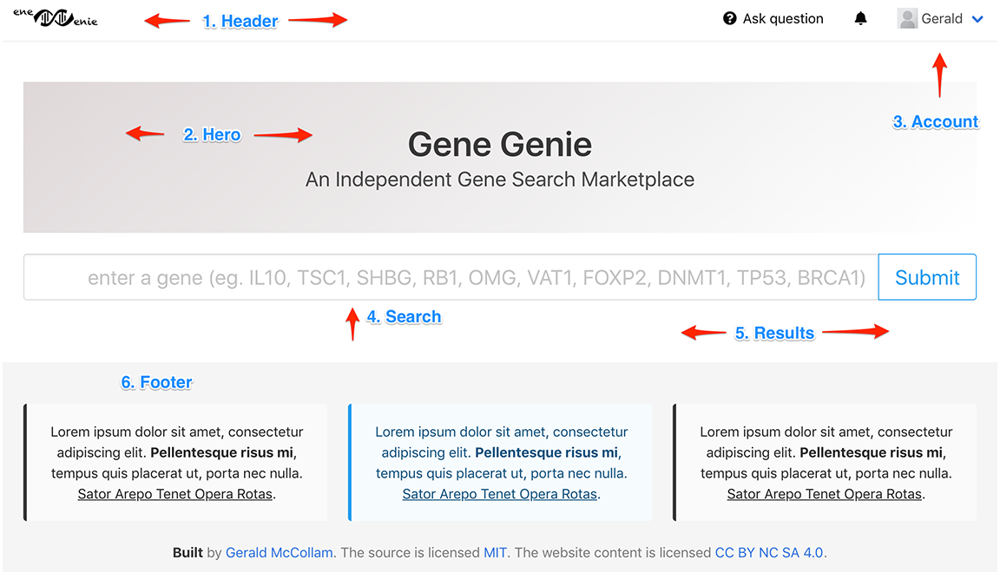
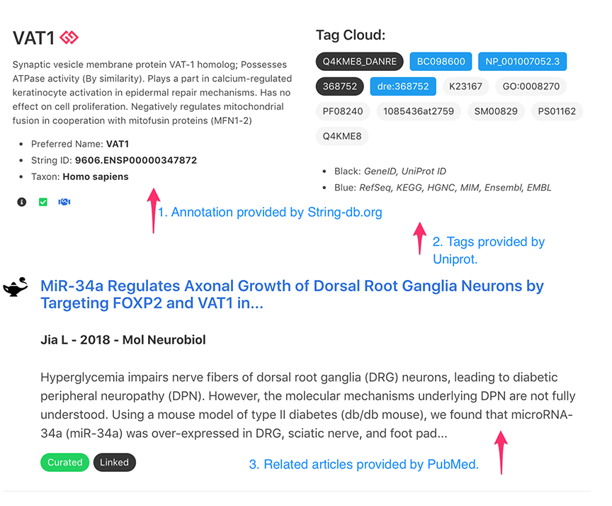

# Gene-Genie

A web API and client for aggregating genomic information from multiple data sources.

## Overview

Genomics APIs provide secure, predictable access to an expanding volume and diversity of genomic data. Gene-Genie consolidates information from multiple API sources into a unified interface, simplifying the process of querying and cross-referencing genomic databases.

**Data Sources:**

- **Entrez** — Access to PubMed, PMC, Gene, and Nuccore databases
- **String-db.org** — Protein annotations and network interactions
- **UniProt** — Resource ID tags and cross-references
- **GenomeWeb** — Genomics news and articles

## Features

- Search genes by name and retrieve functional annotations
- Cross-reference identifiers across multiple databases
- Fetch related articles from PubMed
- Display protein-protein interaction networks
- Tag cloud visualization of database cross-references

## Architecture

The project consists of two components:

- **API Layer** — Flask-based REST API that wraps external genomics data sources
- **Web Client** — Flask application with a search interface styled using [Bulma](https://bulma.io)

> **Note:** A migration to FastAPI is planned. See [Roadmap](#roadmap) for details.

## Installation

### Prerequisites

- Python 3.8+
- pip

### Setup

```bash
# Clone the repository
git clone https://github.com/<your-username>/gene_genie.git
cd gene_genie

# Create and activate virtual environment
python3 -m venv venv
source ./venv/bin/activate

# Install dependencies
pip install -r requirements.txt
```

## Usage

### Running Locally

```bash
cd gene_genie
source ./venv/bin/activate

export FLASK_APP=gene_genie.py
export FLASK_ENV=development

flask run -h localhost -p 8000
```

The web client will be available at `http://localhost:8000/`.

### Web Client

The web client provides a search interface for querying genomic data:

**Search Page**



- **Header** — Navigation with link to home
- **Search** — Gene name entry form
- **Results** — Display area for query results

**Results Page**



- **Annotations** — Functional annotations from String-db.org
- **Tags** — Cross-reference IDs to external databases
- **Related Articles** — Publications from PubMed
- **Interaction Graph** — Protein network visualization (when available)

## API Reference

| HTTP Method | Endpoint | Description |
|-------------|----------|-------------|
| POST | `/api/v1.0/stringdb/annotation/<term>` | Retrieve annotation from String-db.org |
| POST | `/api/v1.0/stringdb/annotations/<term>` | Retrieve multiple annotations from String-db.org |
| POST | `/api/v1.0/uniprot/<term>` | Retrieve resource ID tags from UniProt |
| GET | `/api/v1.0/pubmed/summary/<pmid>` | Retrieve summary article from PubMed |
| GET | `/api/v1.0/genomeweb/article/<gwid>` | Retrieve single news item from GenomeWeb |
| GET | `/api/v1.0/genomeweb/articles/` | Retrieve multiple news items from GenomeWeb |

### Example Requests

```bash
# String-db annotations
curl -i http://localhost:8000/api/v1.0/stringdb/annotation/BRCA1
curl -i http://localhost:8000/api/v1.0/stringdb/annotations/BRCA1

# UniProt cross-references
curl -i http://localhost:8000/api/v1.0/uniprot/BRCA1

# PubMed article summary
curl -i http://localhost:8000/api/v1.0/pubmed/summary/31411802

# GenomeWeb news
curl -i http://localhost:8000/api/v1.0/genomeweb/article/1
curl -i http://localhost:8000/api/v1.0/genomeweb/articles/
```

## Deployment

### Cloud Deployment (AWS EC2)

```bash
# Install dependencies on EC2 instance
sudo apt-get install python3-venv

# Clone and set up the project
git clone https://github.com/<your-username>/gene_genie.git
cd gene_genie
python3 -m venv venv
source ./venv/bin/activate
pip install -r requirements.txt

# Run the application
./run.sh
```

The application will be accessible at `http://<your-ec2-public-ip>:8000/`.

> **Tip:** For production deployments, consider using Gunicorn with Nginx as a reverse proxy.

## Development

### Running API Modules Directly

Individual API modules can be run standalone for testing and development:

```bash
source ./venv/bin/activate

# Entrez API
./app/api/entrez_api.py

# String-db API
./app/api/stringdb_api.py

# UniProt API
./app/api/uniprot_api.py

# PubMed API
./app/api/pubmed_api.py
```

**GenomeWeb API** (interactive):

```python
from app.api import genome_web_api

gw_api = genome_web_api.GenomeWebAPI()
items = gw_api.fetch()
print(items)
```

## Roadmap

- [ ] Migrate from Flask to FastAPI
- [ ] Add async support for concurrent API requests
- [ ] Implement response caching
- [ ] Add OpenAPI/Swagger documentation
- [ ] Containerize with Docker
- [ ] Add unit and integration tests

## License

[Add your license here]